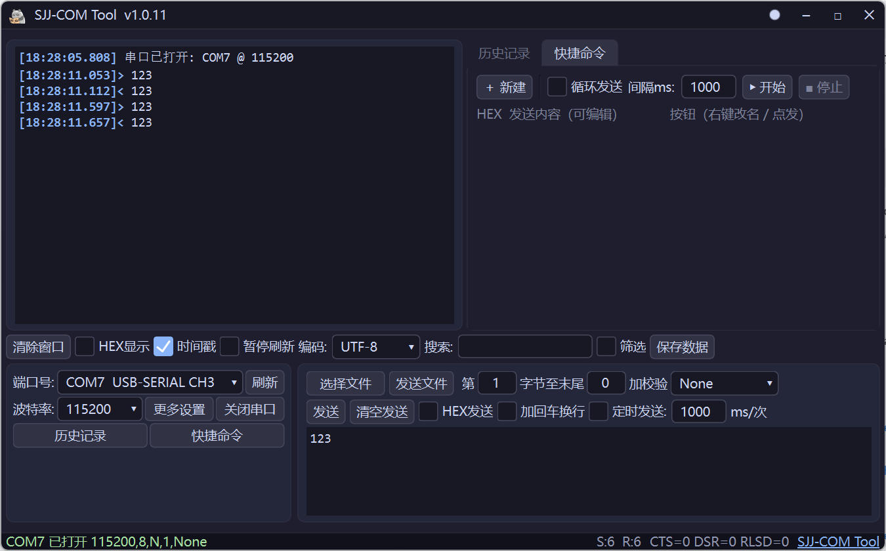
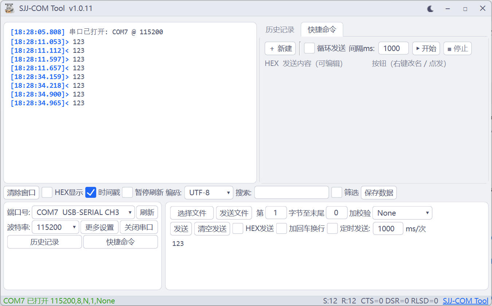

# SuperCOM

Windows 串口调试工具（**C++ / Qt6** 实现），模仿 SSCOM 软件功能，增加接收区滚动暂停、字符编码切换、搜索、筛选功能。

## 目录说明

| 路径 | 说明 |
|------|------|
| `cpp/` | C++/Qt6 源码工程（CMake 构建） |
| `cpp/README.md` | 依赖要求、构建与部署说明 |
| `cpp/dist/` | 动态链接版（exe + Qt 运行库文件夹，免安装） |
| `cpp/dist_static/SuperCOM.exe` | **静态单文件版**（零依赖，一个 exe 拷贝即用，strip 后约 20MB，Defender 干净） |
| `imgs/` | 应用图标与界面截图 |

## 功能特性

- 串口打开/关闭；波特率/数据位/停止位/校验位/流控/读超时（更多串口设置弹窗）
- HEX/文本双模式收发；HEX 显示；时间戳+分包显示；接收编码切换（UTF-8/GBK/...）
- 暂停刷新：滚轮上翻/拖动滚动条自动勾选，滚回底部自动取消
- 接收区高亮（搜索关键字）；筛选（只显示匹配消息）；接收内容存内存（上限 5000）
- 加校验（None/0-ADD8/ADD8/XOR8/ADD16/ModbusCRC16/CCITT-CRC16/CRC32）
- 历史记录 / 快捷命令面板（循环发送）；定时发送；文件发送（可停止）
- 发送历史自动记录；参数自动保存/加载（`sscom_config.json`）
- 深色/浅色双主题；无边框窗口（DWM 阴影/圆角）；GitHub 自动更新检查与下载
